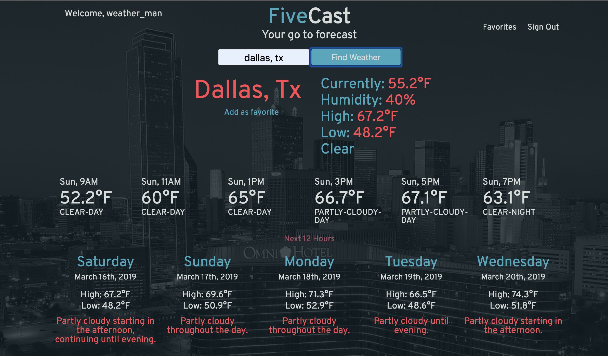
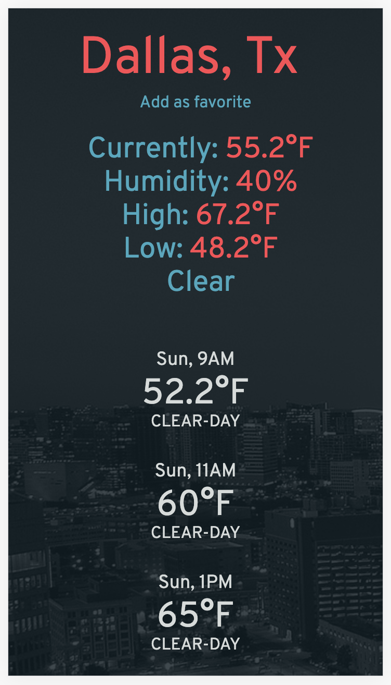

# FiveCast - Weather Forecast

[FiveCast](https://sweater-weather-1810.surge.sh), or Sweater Weather front end, is a vanilla javascript (minus ajax requests) front end to consume the Sweater Weather back end API, [deployed API](https://sweater-weather-1810.herokuapp.com/api/v1/forecast?location=denver,co), [github](https://github.com/jpclark6/sweater-weather). It displays the current weather, up to 24 hours of hourly forecasts, and 5 days of daily forecasts, hence the name FiveCast. It allows for user registration and login, and the ability to favorite locations. In addition it displays a background image of the city you are viewing.




## Getting Started

### Prerequsites

You must have npm and node.js installed to successfully run this project.

### Installing

To run on localhost clone the repo to an appropriate directory, install dependencies, and then start a live server.

```
git clone git@github.com:jpclark6/sweater-weather-fe.git
npm install
npm start
```

Visit localhost:3000, or whatever port you decide to run it on, and enter in a location to see the forecast. Note: back end may take up to 30 seconds to restart dynos if it hasn't run in a while.

## Deployment

It is currently deployed [here](https://sweater-weather-1810.surge.sh) using surge.

## Authors

The back end and front end were both solo project by [me](https://github.com/jpclark6).


